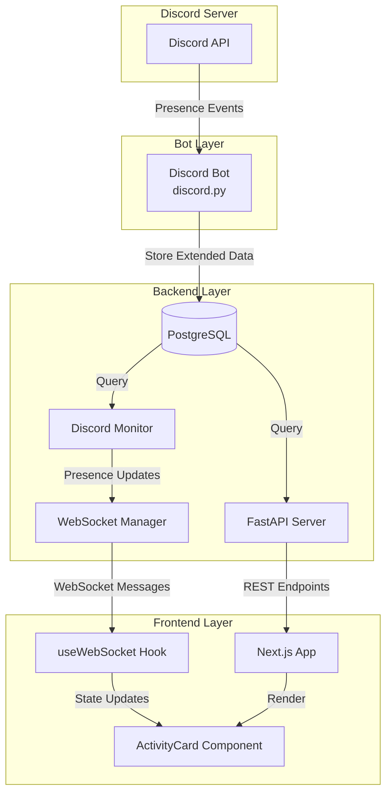

# Design Document: Discord Activity Cards

## Overview

Эта функция расширяет существующую систему мониторинга Discord для отображения детальных карточек активности пользователей в стиле нативного Discord UI. Система будет собирать расширенные данные присутствия (роли, иконки игр, временные метки активности, детальные статусы), хранить их в PostgreSQL, и отображать в виде визуально привлекательных карточек с real-time обновлениями через WebSocket.

Ключевые улучшения:
- Расширение схемы БД для хранения ролей, иконок игр и временных меток
- Обновление Discord бота для сбора полных данных присутствия
- Расширение REST API и WebSocket протокола для передачи новых данных
- Новый React компонент карточки активности с Discord-подобным дизайном
- Адаптивная сетка карточек с поддержкой мобильных устройств
- Оптимизация производительности через мемоизацию и кэширование

## Architecture

### System Components



### Data Flow

1. **Collection Phase**: Discord бот получает события присутствия и собирает:
   - Базовые данные: статус, активность, никнейм
   - Роли пользователя с названиями и цветами
   - URL иконки игры (если доступна)
   - Временную метку начала активности

2. **Storage Phase**: Бот сохраняет данные в таблицу `discord_presence` с расширенными полями

3. **Distribution Phase**: 
   - REST API предоставляет endpoint для получения текущего состояния
   - WebSocket транслирует обновления всем подключенным клиентам
   - Сообщения включают все расширенные поля

4. **Presentation Phase**:
   - Frontend получает данные через WebSocket или REST API
   - Компонент `DiscordActivityCard` рендерит карточки
   - Относительное время обновляется каждую минуту
   - Адаптивная сетка подстраивается под размер экрана

### Technology Stack

- **Backend**: Python 3.12, FastAPI, asyncpg, discord.py
- **Database**: PostgreSQL 15+
- **Frontend**: Next.js 14, React 18, TypeScript, Tailwind CSS
- **Real-time**: WebSocket (native browser API)
- **Testing**: Vitest, fast-check (property-based testing)

## Components and Interfaces

### Database Schema Extensions

Расширение таблицы `discord_presence`:

```sql
ALTER TABLE discord_presence 
ADD COLUMN IF NOT EXISTS roles JSONB DEFAULT '[]',
ADD COLUMN IF NOT EXISTS activity_started_at TIMESTAMP,
ADD COLUMN IF NOT EXISTS game_icon_url TEXT;

-- Индекс для быстрого поиска по времени активности
CREATE INDEX IF NOT EXISTS idx_presence_activity_started 
ON discord_presence(activity_started_at DESC);
```

Структура поля `roles`:
```json
[
  {"name": "Модератор", "color": "#ff5733"},
  {"name": "Игрок", "color": "#33ff57"}
]
```

### Backend Components

#### 1. Discord Bot Extensions

Файл: `bot/main.py`

Расширение функции `upsert_presence`:

```python
async def upsert_presence(self, member: discord.Member):
    """Сохранить расширенные данные присутствия"""
    if member.bot:
        return

    status = str(member.status) if member.status else "offline"
    
    # Сбор ролей (исключаем @everyone)
    roles = [
        {
            "name": role.name,
            "color": str(role.color) if role.color.value != 0 else None
        }
        for role in member.roles[1:]  # Пропускаем @everyone
    ]
    
    # Сбор данных активности
    activity_name = None
    activity_type = None
    activity_started_at = None
    game_icon_url = None
    
    for act in getattr(member, "activities", []) or []:
        if act is None:
            continue
        
        name = getattr(act, "name", None)
        if name:
            activity_name = str(name)[:200]
            activity_type = str(getattr(act, "type", None)).split(".")[-1]
            
            # Получаем timestamp начала активности
            start = getattr(act, "start", None)
            if start:
                activity_started_at = start
            
            # Получаем иконку игры (для Rich Presence)
            if hasattr(act, "large_image_url"):
                game_icon_url = act.large_image_url
            elif hasattr(act, "small_image_url"):
                game_icon_url = act.small_image_url
            
            break
    
    async with self.db_pool.acquire() as conn:
        await conn.execute(
            """
            INSERT INTO discord_presence (
                discord_id, status, activity_name, activity_type,
                roles, activity_started_at, game_icon_url, updated_at
            )
            VALUES ($1, $2, $3, $4, $5, $6, $7, NOW())
            ON CONFLICT (discord_id) DO UPDATE SET
                status = EXCLUDED.status,
                activity_name = EXCLUDED.activity_name,
                activity_type = EXCLUDED.activity_type,
                roles = EXCLUDED.roles,
                activity_started_at = EXCLUDED.activity_started_at,
                game_icon_url = EXCLUDED.game_icon_url,
                updated_at = NOW()
            """,
            member.id,
            status,
            activity_name,
            activity_type,
            json.dumps(roles),
            activity_started_at,
            game_icon_url,
        )
```

#### 2. WebSocket Message Models

Файл: `backend/app/models/websocket_messages.py`

Расширение модели `ActivityData`:

```python
from typing import List, Optional
from datetime import datetime

class RoleData(BaseModel):
    """Данные о роли пользователя"""
    name: str
    color: Optional[str] = None

class ActivityData(BaseModel):
    """Расширенные данные об активности пользователя"""
    user_id: str
    username: str
    avatar_url: Optional[str] = None
    game: Optional[str] = None
    status: Literal["online", "offline", "idle", "dnd"]
    roles: List[RoleData] = []
    activity_started_at: Optional[str] = None  # ISO 8601 timestamp
    game_icon_url: Optional[str] = None
```

#### 3. Discord Monitor Service

Файл: `backend/app/services/discord_monitor.py`

Обновление метода `get_initial_state`:

```python
async def get_initial_state(self) -> dict:
    """Получить полное текущее состояние с расширенными данными"""
    
    activity_rows = await self.db.fetch("""
        SELECT
            p.discord_id,
            COALESCE(u.discord_username, 'Unknown') AS username,
            u.avatar_url,
            p.activity_name as game,
            p.status,
            p.roles,
            p.activity_started_at,
            p.game_icon_url
        FROM discord_presence p
        LEFT JOIN users u ON u.discord_id = p.discord_id
        WHERE p.status IS NOT NULL AND p.status <> 'offline'
        ORDER BY p.updated_at DESC
        LIMIT 50
    """)
    
    activity = [
        {
            "user_id": str(row["discord_id"]),
            "username": row["username"],
            "avatar_url": row["avatar_url"],
            "game": row["game"],
            "status": row["status"],
            "roles": row["roles"] or [],
            "activity_started_at": row["activity_started_at"].isoformat() if row["activity_started_at"] else None,
            "game_icon_url": row["game_icon_url"]
        }
        for row in activity_rows
    ]
    
    statistics = await self._get_statistics()
    
    return {
        "activity": activity,
        "statistics": statistics
    }
```

#### 4. REST API Endpoint

Файл: `backend/app/routes/discord.py` (новый файл)

```python
from fastapi import APIRouter, Depends
import asyncpg
from typing import List
from ..models.websocket_messages import ActivityData, RoleData
from ..main import get_db

router = APIRouter(prefix="/api/discord", tags=["discord"])

@router.get("/presence", response_model=List[ActivityData])
async def get_presence_data(db: asyncpg.Connection = Depends(get_db)):
    """
    Получить текущие данные присутствия всех пользователей
    
    Возвращает список пользователей с их статусами, активностями и ролями.
    Кэшируется на 5 секунд для снижения нагрузки на БД.
    """
    rows = await db.fetch("""
        SELECT
            p.discord_id,
            COALESCE(u.discord_username, 'Unknown') AS username,
            u.avatar_url,
            p.activity_name as game,
            p.status,
            p.roles,
            p.activity_started_at,
            p.game_icon_url
        FROM discord_presence p
        LEFT JOIN users u ON u.discord_id = p.discord_id
        WHERE p.status IS NOT NULL AND p.status <> 'offline'
        ORDER BY p.updated_at DESC
        LIMIT 50
    """)
    
    return [
        ActivityData(
            user_id=str(row["discord_id"]),
            username=row["username"],
            avatar_url=row["avatar_url"],
            game=row["game"],
            status=row["status"],
            roles=[RoleData(**r) for r in (row["roles"] or [])],
            activity_started_at=row["activity_started_at"].isoformat() if row["activity_started_at"] else None,
            game_icon_url=row["game_icon_url"]
        )
        for row in rows
    ]
```

### Frontend Components

#### 1. DiscordActivityCard Component

Файл: `frontend/components/DiscordActivityCard.tsx`

```typescript
import React, { useMemo } from 'react'
import Image from 'next/image'

interface Role {
  name: string
  color?: string
}

interface DiscordActivityCardProps {
  userId: string
  username: string
  avatarUrl?: string
  game?: string
  status: 'online' | 'offline' | 'idle' | 'dnd'
  roles?: Role[]
  activityStartedAt?: string
  gameIconUrl?: string
}

export const DiscordActivityCard = React.memo(function DiscordActivityCard({
  userId,
  username,
  avatarUrl,
  game,
  status,
  roles = [],
  activityStartedAt,
  gameIconUrl
}: DiscordActivityCardProps) {
  // Вычисление относительного времени
  const relativeTime = useMemo(() => {
    if (!activityStartedAt) return 'Сейчас'
    
    const start = new Date(activityStartedAt)
    const now = new Date()
    const diffMs = now.getTime() - start.getTime()
    const diffMinutes = Math.floor(diffMs / 60000)
    
    if (diffMinutes < 60) {
      return `${diffMinutes} мин. назад`
    } else if (diffMinutes < 1440) {
      const hours = Math.floor(diffMinutes / 60)
      return `${hours} ч. назад`
    } else if (diffMinutes < 10080) {
      const days = Math.floor(diffMinutes / 1440)
      return `${days} д. назад`
    } else {
      const weeks = Math.floor(diffMinutes / 10080)
      return `${weeks} нед. назад`
    }
  }, [activityStartedAt])
  
  // Цвет индикатора статуса
  const statusColor = {
    online: '#4aff75',
    offline: '#747f8d',
    idle: '#faa61a',
    dnd: '#f04747'
  }[status]
  
  // Ограничение ролей до 5
  const displayRoles = roles.slice(0, 5)
  const extraRolesCount = roles.length - 5
  
  return (
    <div className="discord-activity-card">
      {/* Аватар с индикатором статуса */}
      <div className="avatar-container">
        <Image
          src={avatarUrl || '/default-avatar.png'}
          alt={username}
          width={64}
          height={64}
          className="avatar"
        />
        <div 
          className="status-indicator"
          style={{ backgroundColor: statusColor }}
        />
      </div>
      
      {/* Информация о пользователе */}
      <div className="user-info">
        <h3 className="username">{username}</h3>
        
        {/* Роли */}
        {displayRoles.length > 0 && (
          <div className="roles">
            {displayRoles.map((role, idx) => (
              <span
                key={idx}
                className="role-badge"
                style={{
                  backgroundColor: role.color || '#747f8d'
                }}
              >
                {role.name}
              </span>
            ))}
            {extraRolesCount > 0 && (
              <span className="role-badge extra">+{extraRolesCount}</span>
            )}
          </div>
        )}
      </div>
      
      {/* Игровая активность */}
      {game && (
        <div className="game-activity">
          {gameIconUrl && (
            <Image
              src={gameIconUrl}
              alt={game}
              width={64}
              height={64}
              className="game-icon"
              loading="lazy"
            />
          )}
          <div className="game-info">
            <p className="game-name">{game}</p>
            <p className="game-time">{relativeTime}</p>
          </div>
        </div>
      )}
      
      <style jsx>{`
        .discord-activity-card {
          background: rgba(0, 0, 0, 0.4);
          border: 1px solid rgba(255, 255, 255, 0.1);
          border-radius: 12px;
          padding: 1rem;
          display: flex;
          flex-direction: column;
          gap: 0.75rem;
          min-width: 280px;
          box-shadow: 0 4px 6px rgba(0, 0, 0, 0.3);
          transition: transform 0.2s, box-shadow 0.2s;
        }
        
        .discord-activity-card:hover {
          transform: translateY(-2px);
          box-shadow: 0 6px 12px rgba(0, 0, 0, 0.4);
        }
        
        .avatar-container {
          position: relative;
          width: 64px;
          height: 64px;
        }
        
        .avatar {
          border-radius: 50%;
          object-fit: cover;
        }
        
        .status-indicator {
          position: absolute;
          bottom: 0;
          right: 0;
          width: 12px;
          height: 12px;
          border-radius: 50%;
          border: 2px solid rgba(0, 0, 0, 0.4);
        }
        
        .user-info {
          display: flex;
          flex-direction: column;
          gap: 0.5rem;
        }
        
        .username {
          font-family: 'Unbounded', sans-serif;
          font-size: 1rem;
          font-weight: 600;
          color: #ffffff;
          margin: 0;
        }
        
        .roles {
          display: flex;
          flex-wrap: wrap;
          gap: 4px;
        }
        
        .role-badge {
          padding: 2px 8px;
          border-radius: 4px;
          font-size: 0.75rem;
          font-weight: 500;
          color: #ffffff;
          height: 20px;
          display: inline-flex;
          align-items: center;
        }
        
        .role-badge.extra {
          background-color: #747f8d;
        }
        
        .game-activity {
          display: flex;
          gap: 0.75rem;
          align-items: center;
          padding-top: 0.5rem;
          border-top: 1px solid rgba(255, 255, 255, 0.1);
        }
        
        .game-icon {
          border-radius: 8px;
          object-fit: cover;
        }
        
        .game-info {
          flex: 1;
        }
        
        .game-name {
          font-size: 0.875rem;
          font-weight: 600;
          color: #ffffff;
          margin: 0 0 0.25rem 0;
        }
        
        .game-time {
          font-size: 0.75rem;
          color: #b9bbbe;
          margin: 0;
        }
        
        @media (max-width: 768px) {
          .username {
            font-size: 0.875rem;
          }
          
          .game-name {
            font-size: 0.8125rem;
          }
        }
      `}</style>
    </div>
  )
})
```

#### 2. DiscordActivityGrid Component

Файл: `frontend/components/DiscordActivityGrid.tsx`

```typescript
import React, { useState, useEffect } from 'react'
import { DiscordActivityCard } from './DiscordActivityCard'
import { useWebSocket, DiscordUpdate } from '../hooks/useWebSocket'
import { ConnectionStatusIndicator } from './ConnectionStatusIndicator'

interface ActivityData {
  user_id: string
  username: string
  avatar_url?: string
  game?: string
  status: 'online' | 'offline' | 'idle' | 'dnd'
  roles?: Array<{ name: string; color?: string }>
  activity_started_at?: string
  game_icon_url?: string
}

export function DiscordActivityGrid() {
  const [activities, setActivities] = useState<ActivityData[]>([])
  
  const handleMessage = (update: DiscordUpdate) => {
    if (update.type === 'initial_state') {
      setActivities(update.data?.activity || [])
    } else if (update.type === 'activity_update') {
      // Обновление конкретного пользователя
      const userId = update.data?.user_id
      if (userId) {
        setActivities(prev => {
          const index = prev.findIndex(a => a.user_id === userId)
          if (index >= 0) {
            // Обновляем существующего
            const updated = [...prev]
            updated[index] = { ...updated[index], ...update.data }
            return updated
          } else {
            // Добавляем нового
            return [...prev, update.data]
          }
        })
      }
    }
  }
  
  const { status } = useWebSocket({
    url: process.env.NEXT_PUBLIC_WS_URL || 'ws://localhost:8000/ws',
    token: 'public',
    onMessage: handleMessage,
    enabled: true
  })
  
  // Обновление относительного времени каждую минуту
  useEffect(() => {
    const interval = setInterval(() => {
      setActivities(prev => [...prev])  // Триггерим ре-рендер
    }, 60000)
    
    return () => clearInterval(interval)
  }, [])
  
  return (
    <div className="discord-activity-section">
      <div className="section-header">
        <h2>ЧТО ПРОИСХОДИТ В DISCORD</h2>
        <ConnectionStatusIndicator status={status} />
      </div>
      
      <div className="activity-grid">
        {activities.map(activity => (
          <DiscordActivityCard
            key={activity.user_id}
            userId={activity.user_id}
            username={activity.username}
            avatarUrl={activity.avatar_url}
            game={activity.game}
            status={activity.status}
            roles={activity.roles}
            activityStartedAt={activity.activity_started_at}
            gameIconUrl={activity.game_icon_url}
          />
        ))}
      </div>
      
      <style jsx>{`
        .discord-activity-section {
          padding: 2rem;
        }
        
        .section-header {
          display: flex;
          justify-content: space-between;
          align-items: center;
          margin-bottom: 1.5rem;
        }
        
        .section-header h2 {
          font-family: 'Unbounded', sans-serif;
          font-size: 1.5rem;
          font-weight: 700;
          color: #4aff75;
          margin: 0;
        }
        
        .activity-grid {
          display: grid;
          grid-template-columns: repeat(auto-fill, minmax(280px, 1fr));
          gap: 1rem;
        }
        
        @media (min-width: 1024px) {
          .activity-grid {
            grid-template-columns: repeat(3, 1fr);
          }
        }
        
        @media (min-width: 768px) and (max-width: 1023px) {
          .activity-grid {
            grid-template-columns: repeat(2, 1fr);
          }
        }
        
        @media (max-width: 767px) {
          .discord-activity-section {
            padding: 1rem;
          }
          
          .section-header h2 {
            font-size: 1.25rem;
          }
          
          .activity-grid {
            grid-template-columns: 1fr;
          }
        }
      `}</style>
    </div>
  )
}
```

## Data Models

### Database Models

```sql
-- Расширенная таблица discord_presence
CREATE TABLE discord_presence (
    discord_id BIGINT PRIMARY KEY,
    status VARCHAR(20),                    -- online/idle/dnd/offline
    activity_name VARCHAR(200),            -- название игры/активности
    activity_type VARCHAR(50),             -- тип активности
    roles JSONB DEFAULT '[]',              -- массив ролей [{name, color}]
    activity_started_at TIMESTAMP,         -- когда началась активность
    game_icon_url TEXT,                    -- URL иконки игры
    updated_at TIMESTAMP DEFAULT NOW()
);

-- Индексы
CREATE INDEX idx_presence_status ON discord_presence(status);
CREATE INDEX idx_presence_updated_at ON discord_presence(updated_at);
CREATE INDEX idx_presence_activity_started ON discord_presence(activity_started_at DESC);
```

### API Models

```typescript
// TypeScript интерфейсы для фронтенда

interface Role {
  name: string
  color?: string  // hex color, например "#ff5733"
}

interface ActivityData {
  user_id: string
  username: string
  avatar_url?: string
  game?: string
  status: 'online' | 'offline' | 'idle' | 'dnd'
  roles: Role[]
  activity_started_at?: string  // ISO 8601 timestamp
  game_icon_url?: string
}

interface InitialStateMessage {
  type: 'initial_state'
  timestamp: string
  data: {
    activity: ActivityData[]
    statistics: StatisticsData
  }
}

interface ActivityUpdateMessage {
  type: 'activity_update'
  timestamp: string
  data: Partial<ActivityData> & { user_id: string }
}
```


## Correctness Properties

*A property is a characteristic or behavior that should hold true across all valid executions of a system-essentially, a formal statement about what the system should do. Properties serve as the bridge between human-readable specifications and machine-verifiable correctness guarantees.*

### Property 1: Presence data persistence round-trip

*For any* presence data with roles and activity timestamps, storing to the database and then retrieving should preserve all role information (names and colors) and the exact activity start timestamp.

**Validates: Requirements 1.5, 1.6**

### Property 2: Bot collects all user roles

*For any* Discord member with roles on the server, when presence updates, the bot should collect all roles (excluding @everyone).

**Validates: Requirements 2.1**

### Property 3: Bot collects role colors in hex format

*For any* role with a color, the bot should collect the color in hexadecimal format (e.g., "#ff5733").

**Validates: Requirements 2.2**

### Property 4: Bot records activity timestamps

*For any* user activity start event, the bot should record a timestamp for when the activity started.

**Validates: Requirements 2.3**

### Property 5: Bot collects detailed status

*For any* presence update event, the bot should collect the detailed status (online/offline/idle/dnd).

**Validates: Requirements 2.4**

### Property 6: Bot collects game icons when available

*For any* game activity with an available icon, the bot should collect the game icon URL.

**Validates: Requirements 2.5**

### Property 7: API returns complete presence data

*For any* presence data request, the API response should include all fields: roles (as array of objects with name and color), activity timestamps, detailed statuses, and game icons (when available).

**Validates: Requirements 3.1, 3.2, 3.3, 3.4, 3.6**

### Property 8: WebSocket broadcasts complete presence data

*For any* presence update event, the WebSocket broadcast message should include all Presence_Data fields: roles, activity timestamps, detailed statuses, and game icons (when available).

**Validates: Requirements 4.1, 4.2, 4.3, 4.4, 4.6**

### Property 9: Card displays user information

*For any* user activity data, the Discord_Activity_Card should display the user nickname.

**Validates: Requirements 5.2**

### Property 10: Card displays roles as badges

*For any* user with roles, the Discord_Activity_Card should display the roles as colored badges.

**Validates: Requirements 5.3**

### Property 11: Card displays game information

*For any* user playing a game, the Discord_Activity_Card should display the game name and icon (if available).

**Validates: Requirements 5.4, 5.5**

### Property 12: Card displays relative time

*For any* activity with a start timestamp, the Discord_Activity_Card should display relative time since activity started.

**Validates: Requirements 5.6**

### Property 13: Card displays status with correct color

*For any* user status, the Discord_Activity_Card should display a status indicator with the appropriate color (green for online, gray for offline, red for dnd, yellow for idle).

**Validates: Requirements 5.7**

### Property 14: Relative time formatting

*For any* activity duration, the relative time should be formatted correctly: minutes for <1 hour, hours for <24 hours, days for <7 days, weeks for ≥7 days.

**Validates: Requirements 7.1, 7.2, 7.3, 7.4**

### Property 15: Relative time updates periodically

*For any* Discord_Activity_Card with an activity timestamp, the relative time display should update every 60 seconds without full page reload.

**Validates: Requirements 7.5**

### Property 16: Role display with limit

*For any* user with roles, the Discord_Activity_Card should display all roles up to 5, and if there are more than 5 roles, display the first 5 with a "+N" indicator showing the count of remaining roles.

**Validates: Requirements 8.1, 8.6**

### Property 17: Role color application

*For any* role with a color, the Discord_Activity_Card should apply that color to the badge background; for roles without a color, a default gray color should be used.

**Validates: Requirements 8.2**

### Property 18: Game icon display

*For any* game activity with an icon URL, the Discord_Activity_Card should display the game icon.

**Validates: Requirements 9.1**

### Property 19: WebSocket updates card state

*For any* presence update message received via WebSocket, the Frontend_Client should update the corresponding Discord_Activity_Card with the new data.

**Validates: Requirements 10.1, 10.3**

### Property 20: WebSocket adds new cards

*For any* new user coming online, the Frontend_Client should add a new Discord_Activity_Card to the display.

**Validates: Requirements 10.2**

### Property 21: WebSocket connection resilience

*For any* WebSocket disconnection event, the Frontend_Client should automatically attempt to reconnect.

**Validates: Requirements 10.5**

### Property 22: Connection status indicator display

*For any* WebSocket connection state (connected/disconnected/reconnecting), the Frontend_Client should display the appropriate connection status indicator.

**Validates: Requirements 10.6**

### Property 23: Responsive layout maintains aspect ratio

*For any* screen size, the Discord_Activity_Card should maintain its aspect ratio.

**Validates: Requirements 11.4**

### Property 24: Responsive font sizes

*For any* screen size, the Discord_Activity_Card should use appropriate font sizes (16px on desktop ≥768px, 14px on mobile <768px).

**Validates: Requirements 11.5**

### Property 25: API caching behavior

*For any* two presence data requests made within 5 seconds, the second request should return cached data from the first request.

**Validates: Requirements 12.3**

### Property 26: WebSocket broadcasts only changed fields

*For any* presence update where only some fields changed, the WebSocket broadcast should include only the changed fields plus the user_id.

**Validates: Requirements 12.5**

### Property 27: Debounced relative time updates

*For any* Discord_Activity_Card, relative time updates should not occur more frequently than once per minute.

**Validates: Requirements 12.6**

## Error Handling

### Database Errors

1. **Connection Failures**: If database connection fails, the bot should log the error and retry with exponential backoff (max 3 attempts)
2. **Constraint Violations**: If presence data violates constraints (e.g., invalid JSON in roles field), log the error and skip the update
3. **Query Timeouts**: If a query takes longer than 5 seconds, cancel it and return cached data or empty result

### Discord API Errors

1. **Rate Limiting**: If Discord API rate limit is hit, the bot should respect the retry-after header and queue updates
2. **Missing Permissions**: If bot lacks permissions to read roles, log a warning and store presence data without roles
3. **Invalid Member Data**: If member data is malformed, log the error and skip that member

### WebSocket Errors

1. **Connection Failures**: Frontend should display "reconnecting" status and attempt reconnection with exponential backoff
2. **Message Parse Errors**: If a WebSocket message cannot be parsed, log the error and ignore the message
3. **Out-of-Order Messages**: If messages arrive out of order (based on timestamp), ignore older messages

### Frontend Errors

1. **Image Load Failures**: If avatar or game icon fails to load, display a default placeholder image
2. **Invalid Data**: If activity data is missing required fields, skip rendering that card and log a warning
3. **State Update Errors**: If React state update fails, log the error and attempt to recover by refetching initial state

### API Errors

1. **404 Not Found**: Return empty array with 200 status (no presence data available)
2. **500 Internal Server Error**: Log the error, return cached data if available, otherwise return 503 Service Unavailable
3. **Timeout**: If database query times out, return cached data or 503 status

## Testing Strategy

### Unit Testing

Unit tests will focus on specific examples, edge cases, and error conditions:

**Backend Tests** (pytest):
- Test presence data storage with various role configurations
- Test API endpoint responses with mock database data
- Test WebSocket message formatting
- Test error handling for database failures
- Test caching behavior with time-based scenarios

**Frontend Tests** (Vitest):
- Test DiscordActivityCard rendering with various props
- Test relative time calculation for specific timestamps
- Test role limiting logic (exactly 5 roles, more than 5 roles)
- Test status color mapping for each status type
- Test WebSocket message handling for different message types
- Test responsive grid layout at specific breakpoints
- Test error handling for missing/invalid data

**Bot Tests** (pytest):
- Test role collection from Discord members
- Test activity timestamp extraction
- Test game icon URL extraction
- Test presence data formatting before storage

### Property-Based Testing

Property tests will verify universal properties across all inputs using fast-check (frontend) and Hypothesis (backend). Each test will run a minimum of 100 iterations.

**Backend Property Tests**:

1. **Presence Data Round-Trip** (Property 1)
   - Generate random presence data with roles and timestamps
   - Store to database and retrieve
   - Verify all fields are preserved
   - Tag: *Feature: discord-activity-cards, Property 1: Presence data persistence round-trip*

2. **API Response Completeness** (Property 7)
   - Generate random presence data
   - Call API endpoint
   - Verify response includes all required fields
   - Tag: *Feature: discord-activity-cards, Property 7: API returns complete presence data*

3. **WebSocket Message Completeness** (Property 8)
   - Generate random presence updates
   - Create WebSocket broadcast message
   - Verify message includes all Presence_Data fields
   - Tag: *Feature: discord-activity-cards, Property 8: WebSocket broadcasts complete presence data*

4. **API Caching** (Property 25)
   - Generate random requests within 5-second window
   - Verify second request returns cached data
   - Tag: *Feature: discord-activity-cards, Property 25: API caching behavior*

5. **Changed Fields Only** (Property 26)
   - Generate random presence updates with partial changes
   - Verify broadcast includes only changed fields
   - Tag: *Feature: discord-activity-cards, Property 26: WebSocket broadcasts only changed fields*

**Frontend Property Tests**:

1. **Relative Time Formatting** (Property 14)
   - Generate random activity durations
   - Verify correct format for each time range
   - Tag: *Feature: discord-activity-cards, Property 14: Relative time formatting*

2. **Role Display Limit** (Property 16)
   - Generate random role arrays of varying lengths
   - Verify display shows max 5 roles with correct "+N" indicator
   - Tag: *Feature: discord-activity-cards, Property 16: Role display with limit*

3. **Role Color Application** (Property 17)
   - Generate random roles with and without colors
   - Verify correct color application (custom or default gray)
   - Tag: *Feature: discord-activity-cards, Property 17: Role color application*

4. **Status Color Mapping** (Property 13)
   - Generate random status values
   - Verify correct color for each status
   - Tag: *Feature: discord-activity-cards, Property 13: Card displays status with correct color*

5. **Card Information Display** (Properties 9, 10, 11, 12)
   - Generate random activity data
   - Verify all required information is displayed
   - Tag: *Feature: discord-activity-cards, Property 9-12: Card displays user information*

6. **WebSocket State Updates** (Property 19)
   - Generate random presence update messages
   - Verify card state updates correctly
   - Tag: *Feature: discord-activity-cards, Property 19: WebSocket updates card state*

7. **Responsive Font Sizes** (Property 24)
   - Generate random viewport widths
   - Verify correct font sizes for each breakpoint
   - Tag: *Feature: discord-activity-cards, Property 24: Responsive font sizes*

8. **Debounced Updates** (Property 27)
   - Simulate rapid time updates
   - Verify updates occur at most once per minute
   - Tag: *Feature: discord-activity-cards, Property 27: Debounced relative time updates*

**Bot Property Tests**:

1. **Role Collection** (Property 2)
   - Generate random Discord members with roles
   - Verify all roles (except @everyone) are collected
   - Tag: *Feature: discord-activity-cards, Property 2: Bot collects all user roles*

2. **Hex Color Format** (Property 3)
   - Generate random role colors
   - Verify colors are in hex format
   - Tag: *Feature: discord-activity-cards, Property 3: Bot collects role colors in hex format*

3. **Timestamp Recording** (Property 4)
   - Generate random activity start events
   - Verify timestamps are recorded
   - Tag: *Feature: discord-activity-cards, Property 4: Bot records activity timestamps*

### Integration Testing

Integration tests will verify the complete flow from Discord bot to frontend display:

1. **End-to-End Presence Flow**:
   - Mock Discord presence update event
   - Verify data is stored in database
   - Verify API returns the data
   - Verify WebSocket broadcasts the update
   - Verify frontend displays the card

2. **Real-time Update Flow**:
   - Simulate presence change
   - Verify WebSocket message is sent
   - Verify frontend updates the card within 1 second

3. **Responsive Layout**:
   - Test grid layout at 1024px, 768px, and 320px viewports
   - Verify correct number of columns

### Performance Testing

1. **Rendering Performance**: Verify 50 cards render without lag (< 100ms)
2. **API Response Time**: Verify API responds within 200ms under normal load
3. **WebSocket Latency**: Verify updates arrive within 500ms
4. **Database Query Performance**: Verify queries complete within 100ms with indexes

### Test Coverage Goals

- Backend: 85% code coverage
- Frontend: 80% code coverage
- Property tests: 100% of identified properties
- Integration tests: All critical user flows
