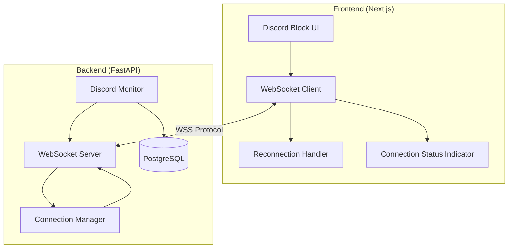

# Design Document: Discord Real-Time Updates

## Overview

Эта функция добавляет WebSocket-based real-time обновления для блока "ЧТО ПРОИСХОДИТ В DISCORD". Система заменяет однократную загрузку данных при загрузке страницы на постоянное двунаправленное соединение, которое мгновенно доставляет обновления об активности Discord: изменения игровой активности, статусов пользователей, топов по сообщениям и голосу.

Архитектура построена на трех основных компонентах:
1. **WebSocket Server** (FastAPI) - управляет соединениями и broadcast обновлений
2. **WebSocket Client** (Next.js/React) - устанавливает соединение и обрабатывает обновления
3. **Connection Management** - обеспечивает надежность через reconnection и fallback механизмы

Система спроектирована с акцентом на надежность (automatic reconnection, fallback to polling), производительность (message batching, UI debouncing) и безопасность (authentication, rate limiting, WSS).

## Architecture

### High-Level Architecture



### Component Responsibilities

**Backend Components:**

- **WebSocket Server** (`/ws/discord` endpoint)
  - Принимает WebSocket соединения
  - Валидирует authentication tokens
  - Управляет lifecycle соединений (connect, disconnect, heartbeat)
  - Broadcast обновлений всем подключенным клиентам
  - Отправляет initial state при подключении

- **Connection Manager**
  - Хранит список активных соединений
  - Удаляет stale connections по heartbeat timeout
  - Реализует rate limiting (5 connections/minute per IP)
  - Управляет message queues для каждого соединения

- **Discord Monitor**
  - Отслеживает изменения в Discord активности через Discord API
  - Детектирует изменения в game activity, user status
  - Периодически обновляет statistics (message/voice leaderboards)
  - Генерирует Discord_Update события для WebSocket Server

**Frontend Components:**

- **WebSocket Client**
  - Устанавливает WebSocket соединение при mount компонента
  - Отправляет authentication token при подключении
  - Валидирует входящие сообщения
  - Обновляет state Discord Block компонента
  - Gracefully закрывает соединение при unmount

- **Reconnection Handler**
  - Детектирует разрыв соединения
  - Реализует exponential backoff (1s → 2s → 4s → ... → 30s max)
  - Ограничивает количество попыток (max 10)
  - Fallback на REST API polling при исчерпании попыток

- **Connection Status Indicator**
  - Отображает текущий статус: connected (зеленый), disconnected (красный), reconnecting (желтый)
  - Использует иконки и цвета для визуальной индикации
  - Минималистичный дизайн, не отвлекающий от контента

### Data Flow

**Connection Establishment:**
1. Discord Block component монтируется
2. WebSocket Client инициирует соединение к `/ws/discord`
3. Client отправляет authentication token
4. Server валидирует token, добавляет connection в active list
5. Server отправляет initial state (current activity + statistics)
6. Client применяет initial state к UI

**Real-Time Updates:**
1. Discord Monitor детектирует изменение (game start, status change, etc.)
2. Monitor генерирует Discord_Update event
3. WebSocket Server получает event
4. Server broadcast сообщение всем active connections (< 100ms)
5. Client получает сообщение, валидирует формат
6. Client обновляет local state
7. React re-renders Discord Block с новыми данными (debounced, max 10 FPS)

**Connection Loss & Recovery:**
1. Network failure → WebSocket connection drops
2. Client детектирует disconnect event
3. Connection Status Indicator → "reconnecting"
4. Reconnection Handler начинает попытки с backoff
5. При успехе: получает fresh initial state, возобновляет updates
6. При исчерпании попыток: fallback на REST API polling (30s interval)

## Components and Interfaces

### Backend API

#### WebSocket Endpoint

```python
# Endpoint: /ws/discord
# Protocol: WebSocket (WSS in production)

@app.websocket("/ws/discord")
async def discord_websocket(websocket: WebSocket, token: str):
    """
    WebSocket endpoint for Discord real-time updates
    
    Query Parameters:
        token: Authentication token (required)
    
    Connection Flow:
        1. Validate token
        2. Accept connection
        3. Send initial state
        4. Listen for heartbeat pongs
        5. Broadcast updates
        6. Handle disconnect
    """
    pass
```

#### Message Types

**Server → Client Messages:**

```typescript
// Initial State Message
{
  "type": "initial_state",
  "timestamp": "2024-01-15T10:30:00Z",
  "data": {
    "activity": [
      {
        "user_id": "123",
        "username": "User1",
        "game": "Dota 2",
        "status": "online"
      }
    ],
    "statistics": {
      "message_leaderboard": [
        {"user_id": "123", "username": "User1", "count": 450}
      ],
      "voice_leaderboard": [
        {"user_id": "456", "username": "User2", "minutes": 120}
      ]
    }
  }
}

// Activity Update Message
{
  "type": "activity_update",
  "timestamp": "2024-01-15T10:31:00Z",
  "data": {
    "user_id": "123",
    "username": "User1",
    "event": "game_start" | "game_stop" | "status_change",
    "game": "Dota 2" | null,
    "status": "online" | "offline" | "idle" | "dnd"
  }
}

// Statistics Update Message
{
  "type": "statistics_update",
  "timestamp": "2024-01-15T10:32:00Z",
  "data": {
    "message_leaderboard": [...],
    "voice_leaderboard": [...]
  }
}

// Heartbeat Ping
{
  "type": "ping",
  "timestamp": "2024-01-15T10:33:00Z"
}
```

**Client → Server Messages:**

```typescript
// Heartbeat Pong
{
  "type": "pong",
  "timestamp": "2024-01-15T10:33:00Z"
}
```

### Frontend Components

#### WebSocketClient Hook

```typescript
interface UseWebSocketOptions {
  url: string;
  token: string;
  onMessage: (data: DiscordUpdate) => void;
  onStatusChange: (status: ConnectionStatus) => void;
}

type ConnectionStatus = 'connected' | 'disconnected' | 'reconnecting';

interface DiscordUpdate {
  type: 'initial_state' | 'activity_update' | 'statistics_update' | 'ping';
  timestamp: string;
  data: any;
}

function useWebSocket(options: UseWebSocketOptions): {
  status: ConnectionStatus;
  disconnect: () => void;
}
```

#### Discord Block Component Integration

```typescript
function DiscordBlock() {
  const [discordData, setDiscordData] = useState<DiscordOverview | null>(null);
  
  const { status } = useWebSocket({
    url: 'wss://api.example.com/ws/discord',
    token: getAuthToken(),
    onMessage: (update) => {
      // Apply update to discordData
      setDiscordData(applyUpdate(discordData, update));
    },
    onStatusChange: (status) => {
      // Update connection indicator
    }
  });
  
  return (
    <div>
      <ConnectionStatusIndicator status={status} />
      {/* Discord activity and statistics UI */}
    </div>
  );
}
```

## Data Models

### Backend Models

```python
from pydantic import BaseModel
from typing import Literal, Optional, List
from datetime import datetime

class ActivityData(BaseModel):
    user_id: str
    username: str
    game: Optional[str]
    status: Literal["online", "offline", "idle", "dnd"]

class LeaderboardEntry(BaseModel):
    user_id: str
    username: str
    count: Optional[int]  # for messages
    minutes: Optional[int]  # for voice

class StatisticsData(BaseModel):
    message_leaderboard: List[LeaderboardEntry]
    voice_leaderboard: List[LeaderboardEntry]

class InitialStateMessage(BaseModel):
    type: Literal["initial_state"]
    timestamp: datetime
    data: dict  # Contains activity and statistics

class ActivityUpdateMessage(BaseModel):
    type: Literal["activity_update"]
    timestamp: datetime
    data: dict  # Contains user_id, event, game, status

class StatisticsUpdateMessage(BaseModel):
    type: Literal["statistics_update"]
    timestamp: datetime
    data: StatisticsData

class HeartbeatMessage(BaseModel):
    type: Literal["ping", "pong"]
    timestamp: datetime

# Union type for all message types
DiscordMessage = InitialStateMessage | ActivityUpdateMessage | StatisticsUpdateMessage | HeartbeatMessage
```

### Frontend Models

```typescript
interface ActivityData {
  user_id: string;
  username: string;
  game: string | null;
  status: 'online' | 'offline' | 'idle' | 'dnd';
}

interface LeaderboardEntry {
  user_id: string;
  username: string;
  count?: number;  // for messages
  minutes?: number;  // for voice
}

interface StatisticsData {
  message_leaderboard: LeaderboardEntry[];
  voice_leaderboard: LeaderboardEntry[];
}

interface DiscordOverview {
  activity: ActivityData[];
  statistics: StatisticsData;
  last_updated: string;
}

interface BaseMessage {
  type: string;
  timestamp: string;
}

interface InitialStateMessage extends BaseMessage {
  type: 'initial_state';
  data: {
    activity: ActivityData[];
    statistics: StatisticsData;
  };
}

interface ActivityUpdateMessage extends BaseMessage {
  type: 'activity_update';
  data: {
    user_id: string;
    username: string;
    event: 'game_start' | 'game_stop' | 'status_change';
    game: string | null;
    status: 'online' | 'offline' | 'idle' | 'dnd';
  };
}

interface StatisticsUpdateMessage extends BaseMessage {
  type: 'statistics_update';
  data: StatisticsData;
}

interface HeartbeatMessage extends BaseMessage {
  type: 'ping' | 'pong';
}

type DiscordMessage = InitialStateMessage | ActivityUpdateMessage | StatisticsUpdateMessage | HeartbeatMessage;
```


## Correctness Properties

*A property is a characteristic or behavior that should hold true across all valid executions of a system-essentially, a formal statement about what the system should do. Properties serve as the bridge between human-readable specifications and machine-verifiable correctness guarantees.*

### Property Reflection

After analyzing all acceptance criteria, I identified several areas of redundancy:

- Properties 2.1, 2.2, 2.3 (game start, game stop, status change events) can be combined into a single property about activity event generation
- Properties 3.1 and 3.2 (message and voice statistics) can be combined into a single property about statistics updates
- Properties 1.2 and 1.3 (add/remove from active connections) are inverse operations and can be tested together
- Properties 4.3, 4.4, 4.5 (message validation and state update) can be combined into a comprehensive validation property
- Properties 5.1, 5.2, 5.3 (connection status indicator states) are all examples of the same property about status reflection

The following properties represent the unique, non-redundant validation requirements:

### Property 1: Connection Lifecycle Management

*For any* client connection, when a client connects it should be added to the active connections list, and when it disconnects it should be removed from the active connections list.

**Validates: Requirements 1.2, 1.3**

### Property 2: Broadcast Delivery

*For any* Discord_Update and any set of connected clients, when the server broadcasts the update, all connected clients should receive the message.

**Validates: Requirements 1.4**

### Property 3: Message Serialization Round-Trip

*For any* valid Discord message object, serializing to JSON then deserializing should produce an equivalent object with the same data.

**Validates: Requirements 1.5**

### Property 4: Activity Event Generation

*For any* user activity change (game start, game stop, or status change), the WebSocket_Server should generate a Discord_Update with the correct event type, user identifier, activity type, and timestamp.

**Validates: Requirements 2.1, 2.2, 2.3, 2.4**

### Property 5: Client Message Processing

*For any* Discord_Update message received by the WebSocket_Client, the client should validate the message format and update the Discord_Block state if valid, or log an error and ignore if invalid.

**Validates: Requirements 2.5, 4.3, 4.4, 4.5**

### Property 6: Statistics Update Generation

*For any* change in message or voice statistics, the WebSocket_Server should generate a Discord_Update with complete leaderboard data including user identifiers and metrics.

**Validates: Requirements 3.1, 3.2, 3.4**

### Property 7: Statistics Rate Limiting

*For any* 30-second time window, the WebSocket_Server should send at most one statistics update to prevent excessive traffic.

**Validates: Requirements 3.3**

### Property 8: Statistics Replacement

*For any* existing statistics data and any new statistics update, when the WebSocket_Client receives the update, the old statistics should be completely replaced with the new data.

**Validates: Requirements 3.5**

### Property 9: Connection Status Reflection

*For any* connection state change (connected, disconnected, reconnecting), the Connection_Status_Indicator should display the corresponding visual state with appropriate color and icon.

**Validates: Requirements 5.4**

### Property 10: Exponential Backoff

*For any* sequence of failed reconnection attempts, the Reconnection_Handler should retry with exponentially increasing delays (1s, 2s, 4s, 8s, 16s, 30s, 30s...) capped at 30 seconds.

**Validates: Requirements 6.2**

### Property 11: Reconnection Attempt Limit

*For any* connection that fails to reconnect, the Reconnection_Handler should attempt at most 10 reconnections before stopping and falling back to REST API polling.

**Validates: Requirements 6.3, 7.3**

### Property 12: Reconnection State Reset

*For any* reconnection attempt that succeeds, the Reconnection_Handler should reset the retry counter to 0 and the backoff timer to 1 second.

**Validates: Requirements 6.4**

### Property 13: Message Queuing During Reconnection

*For any* state changes that occur while reconnecting, the WebSocket_Client should queue them and apply all queued changes after reconnection succeeds.

**Validates: Requirements 6.5**

### Property 14: Error Isolation

*For any* error that occurs while broadcasting to one connection, the WebSocket_Server should log the error and continue serving all other connections without interruption.

**Validates: Requirements 7.1**

### Property 15: Malformed Message Resilience

*For any* malformed message received by the WebSocket_Client, the client should log an error and continue listening for subsequent messages without crashing.

**Validates: Requirements 7.2**

### Property 16: Heartbeat Ping Periodicity

*For any* active WebSocket connection, the WebSocket_Server should send a heartbeat ping message every 30 seconds.

**Validates: Requirements 7.4**

### Property 17: Heartbeat Timeout Disconnection

*For any* client that does not respond to a heartbeat ping within 10 seconds, the WebSocket_Server should close that connection.

**Validates: Requirements 7.5**

### Property 18: Initial State Delivery

*For any* client that connects, the WebSocket_Server should send the complete current state (all activity and statistics) as the first message before any incremental updates.

**Validates: Requirements 8.1**

### Property 19: Initial State Priority

*For any* WebSocket_Client connection, the initial state message should be applied to the UI before any incremental update messages are processed.

**Validates: Requirements 8.2**

### Property 20: Activity Update Inverse Operations

*For any* Activity_Data state and any activity update, applying the update and then applying its inverse operation (e.g., game_start followed by game_stop) should return to the original state.

**Validates: Requirements 8.3**

### Property 21: Timestamp-Based Message Ordering

*For any* Discord_Update with a timestamp older than the last processed update's timestamp, the WebSocket_Client should ignore the message to prevent out-of-order processing.

**Validates: Requirements 8.4, 8.5**

### Property 22: Message Batching

*For any* set of multiple Discord_Updates that occur within a short time window, the WebSocket_Server should batch them into a single transmission when possible to reduce network overhead.

**Validates: Requirements 9.2**

### Property 23: UI Update Debouncing

*For any* sequence of rapid state changes, the WebSocket_Client should debounce UI updates to render at most 10 times per second (100ms minimum interval).

**Validates: Requirements 9.3**

### Property 24: Message Compression Round-Trip

*For any* message larger than 1KB, the WebSocket_Server should compress it using gzip, and the client should be able to decompress it to retrieve the original message data.

**Validates: Requirements 9.4**

### Property 25: Message Queue Size Limit

*For any* connection's message queue, the WebSocket_Server should limit the queue size to at most 100 messages to prevent memory exhaustion.

**Validates: Requirements 9.5**

### Property 26: Authentication Token Requirement

*For any* connection attempt, the WebSocket_Server should require a valid authentication token and reject connections with invalid or missing tokens with a 401 status.

**Validates: Requirements 10.1, 10.2**

### Property 27: Origin Header Validation

*For any* connection attempt, the WebSocket_Server should validate the origin header and reject connections from unauthorized origins to prevent cross-site WebSocket hijacking.

**Validates: Requirements 10.4**

### Property 28: Connection Rate Limiting

*For any* IP address, the WebSocket_Server should limit connection attempts to at most 5 per minute, rejecting additional attempts to prevent abuse.

**Validates: Requirements 10.5**

## Error Handling

### Server-Side Error Handling

**Connection Errors:**
- Invalid authentication token → Reject with 401, log attempt
- Invalid origin header → Reject with 403, log attempt
- Rate limit exceeded → Reject with 429, log IP address
- Connection limit reached → Reject with 503, log event

**Runtime Errors:**
- Broadcast failure to specific client → Log error, remove stale connection, continue serving others
- Message serialization error → Log error with message details, skip that message
- Database query timeout → Log error, send cached data if available
- Heartbeat timeout → Close connection gracefully, log disconnect

**Recovery Strategies:**
- Maintain connection pool with automatic cleanup of stale connections
- Use try-catch blocks around all broadcast operations
- Implement circuit breaker for database queries
- Graceful degradation: serve cached data when database is unavailable

### Client-Side Error Handling

**Connection Errors:**
- Connection refused → Trigger reconnection handler
- Authentication failure → Show error to user, don't retry
- Network timeout → Trigger reconnection handler
- WebSocket not supported → Fall back to REST API polling immediately

**Message Errors:**
- Malformed JSON → Log error, ignore message, continue listening
- Invalid message schema → Log error with validation details, ignore message
- Missing required fields → Log error, ignore message
- Out-of-order timestamp → Log warning, ignore message

**Recovery Strategies:**
- Exponential backoff reconnection (1s → 30s max, 10 attempts)
- After 10 failed reconnections → Fall back to REST API polling (30s interval)
- Queue state changes during reconnection, apply after reconnect
- Show connection status to user (connected/reconnecting/disconnected)
- Preserve last known good state during connection issues

### Error Logging

**Server Logs:**
```python
# Connection events
logger.info(f"WebSocket connected: {client_id}, IP: {ip_address}")
logger.warning(f"Authentication failed: {ip_address}, token: {token[:8]}...")
logger.error(f"Broadcast failed to client {client_id}: {error}")

# Performance events
logger.warning(f"Message queue size exceeded 80% for client {client_id}")
logger.info(f"Heartbeat timeout, closing connection: {client_id}")
```

**Client Logs:**
```typescript
// Connection events
console.log('[WebSocket] Connected to server');
console.warn('[WebSocket] Connection lost, reconnecting...');
console.error('[WebSocket] Reconnection failed, falling back to polling');

// Message events
console.error('[WebSocket] Invalid message format:', error, message);
console.warn('[WebSocket] Out-of-order message ignored:', timestamp);
```

## Testing Strategy

### Dual Testing Approach

Эта функция требует комбинации unit тестов и property-based тестов для полного покрытия:

**Unit Tests** - для конкретных примеров, edge cases и интеграционных точек:
- Lifecycle events (component mount/unmount triggers connection)
- Specific message types (initial_state, activity_update, statistics_update)
- Error conditions (invalid token, malformed message, connection timeout)
- Fallback behavior (WebSocket unavailable → REST polling)
- UI integration (status indicator shows correct state)

**Property-Based Tests** - для универсальных свойств с широким покрытием входных данных:
- Message serialization/deserialization (round-trip)
- Connection lifecycle (add/remove from active list)
- Broadcast delivery (all clients receive messages)
- Reconnection backoff (exponential delays with cap)
- Message ordering (timestamp-based filtering)
- Rate limiting (statistics updates, connection attempts)
- Error isolation (one client's error doesn't affect others)

### Property-Based Testing Configuration

**Library Selection:**
- Backend (Python): `hypothesis` - mature PBT library with excellent FastAPI integration
- Frontend (TypeScript): `fast-check` - comprehensive PBT library for JavaScript/TypeScript

**Test Configuration:**
```python
# Backend property tests
from hypothesis import given, settings
import hypothesis.strategies as st

@settings(max_examples=100)  # Minimum 100 iterations
@given(
    message=st.builds(ActivityUpdateMessage),
    clients=st.lists(st.text(), min_size=1, max_size=10)
)
async def test_broadcast_delivery(message, clients):
    """
    Feature: discord-realtime-updates, Property 2: Broadcast Delivery
    For any Discord_Update and any set of connected clients,
    when the server broadcasts the update, all connected clients should receive the message.
    """
    # Test implementation
    pass
```

```typescript
// Frontend property tests
import fc from 'fast-check';

describe('WebSocket Client Properties', () => {
  it('Property 3: Message Serialization Round-Trip', () => {
    /**
     * Feature: discord-realtime-updates, Property 3: Message Serialization Round-Trip
     * For any valid Discord message object, serializing to JSON then deserializing
     * should produce an equivalent object with the same data.
     */
    fc.assert(
      fc.property(
        fc.record({
          type: fc.constantFrom('initial_state', 'activity_update', 'statistics_update'),
          timestamp: fc.date().map(d => d.toISOString()),
          data: fc.object()
        }),
        (message) => {
          const serialized = JSON.stringify(message);
          const deserialized = JSON.parse(serialized);
          expect(deserialized).toEqual(message);
        }
      ),
      { numRuns: 100 } // Minimum 100 iterations
    );
  });
});
```

### Test Coverage Requirements

**Backend Tests:**
- WebSocket endpoint connection/disconnection
- Authentication and authorization
- Message broadcasting to multiple clients
- Heartbeat ping/pong mechanism
- Connection pool management
- Rate limiting (connections per IP, statistics updates)
- Error handling and isolation
- Message serialization

**Frontend Tests:**
- WebSocket client connection lifecycle
- Message validation and parsing
- State updates from messages
- Reconnection handler with exponential backoff
- Connection status indicator
- Fallback to REST API polling
- Message queuing during reconnection
- UI debouncing

### Integration Tests

**End-to-End Scenarios:**
1. Full connection flow: connect → receive initial state → receive updates → disconnect
2. Reconnection flow: connect → disconnect → reconnect with backoff → receive queued updates
3. Fallback flow: connection fails → fall back to polling → WebSocket becomes available → switch back
4. Multi-client broadcast: multiple clients connected → server sends update → all receive it
5. Authentication flow: connect without token → rejected → connect with valid token → accepted

**Network Simulation:**
- Use tools like `toxiproxy` or `tc` (traffic control) to simulate network conditions
- Test scenarios: packet loss, high latency, connection drops, bandwidth limits
- Verify reconnection logic handles various network failures gracefully

### Performance Tests

**Load Testing:**
- Simulate 100+ concurrent connections
- Measure message delivery latency (should be < 100ms)
- Monitor memory usage with message queues
- Test message batching efficiency

**Stress Testing:**
- Rapid connect/disconnect cycles
- High-frequency message updates
- Large message payloads (test compression)
- Connection rate limiting under attack

### Manual Testing Checklist

- [ ] WebSocket connection establishes successfully in browser DevTools
- [ ] Connection status indicator shows correct states (connected/reconnecting/disconnected)
- [ ] Real-time updates appear in UI without page refresh
- [ ] Disconnecting network shows reconnection behavior
- [ ] After 10 failed reconnections, system falls back to polling
- [ ] Heartbeat keeps connection alive during idle periods
- [ ] Multiple browser tabs all receive updates simultaneously
- [ ] Invalid authentication token is rejected
- [ ] WSS (secure WebSocket) works in production environment

