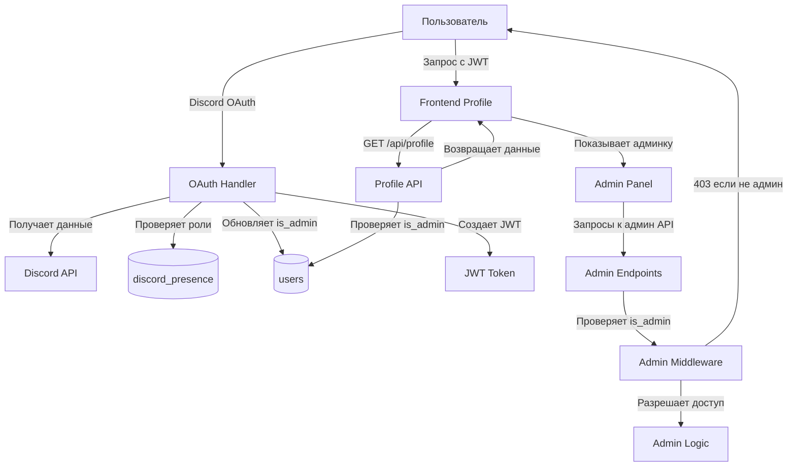

# Design Document: Discord Role-Based Admin

## Overview

Система автоматического управления административными правами на основе Discord роли "🐓ПИТУХ🐓". При авторизации через Discord OAuth система проверяет наличие специальной роли в данных discord_presence и устанавливает флаг is_admin в базе данных. Пользователи с административными правами получают доступ к панели управления контентом через интерфейс профиля.

Ключевые особенности:
- Автоматическое назначение прав при OAuth авторизации
- Интеграция с существующей системой сбора данных Discord бота
- Защита административных эндпоинтов на уровне backend
- Бесшовная интеграция с существующими административными страницами

## Architecture

### System Components



### Data Flow

1. **OAuth Authorization Flow**:
   - Пользователь инициирует вход через Discord
   - Backend получает код авторизации и обменивает на access_token
   - Backend запрашивает данные пользователя из Discord API
   - Backend создает/обновляет запись в таблице users
   - Backend проверяет наличие роли "🐓ПИТУХ🐓" в discord_presence.roles
   - Backend устанавливает is_admin=TRUE или FALSE
   - Backend создает JWT токен с discord_id
   - Frontend получает токен и сохраняет в localStorage

2. **Profile Access Flow**:
   - Frontend отправляет GET /api/profile с JWT токеном
   - Backend извлекает discord_id из токена
   - Backend возвращает данные профиля включая is_admin
   - Frontend отображает вкладку "АДМИНКА" если is_admin=TRUE

3. **Admin Action Flow**:
   - Пользователь кликает на административную функцию
   - Frontend отправляет запрос к /api/admin/* с JWT токеном
   - Backend middleware извлекает user_id из токена
   - Backend проверяет is_admin в базе данных
   - Backend возвращает 403 если is_admin=FALSE
   - Backend выполняет операцию если is_admin=TRUE

### Integration Points

- **Discord OAuth**: backend/app/routes/discord_oauth.py - точка интеграции для проверки ролей
- **Profile API**: backend/app/routes/profile.py - возвращает is_admin статус
- **Admin Middleware**: backend/app/auth.py - функция get_current_admin_user требует обновления
- **Frontend Profile**: frontend/app/profile/page.tsx - отображение админ панели
- **Discord Presence**: таблица discord_presence с JSONB полем roles

## Components and Interfaces

### Backend Components

#### 1. Admin Role Checker Service

**Location**: `backend/app/services/admin_service.py`

**Purpose**: Проверка наличия административной роли в данных Discord

**Interface**:
```python
class AdminService:
    def __init__(self, db: asyncpg.Connection):
        self.db = db
        self.admin_role_name = "🐓ПИТУХ🐓"
    
    async def check_admin_role(self, discord_id: int) -> bool:
        """
        Проверяет наличие роли администратора у пользователя
        
        Args:
            discord_id: Discord ID пользователя
            
        Returns:
            True если пользователь имеет роль "🐓ПИТУХ🐓", иначе False
        """
        pass
    
    async def update_admin_status(self, user_id: int, is_admin: bool) -> None:
        """
        Обновляет статус администратора в таблице users
        
        Args:
            user_id: ID пользователя в таблице users
            is_admin: Новый статус администратора
        """
        pass
    
    async def sync_admin_status_on_login(self, discord_id: int) -> bool:
        """
        Синхронизирует статус администратора при OAuth авторизации
        
        Args:
            discord_id: Discord ID пользователя
            
        Returns:
            Новый статус is_admin
        """
        pass
```

**Dependencies**:
- asyncpg.Connection для доступа к БД
- Таблица discord_presence для чтения ролей
- Таблица users для обновления is_admin

#### 2. Updated OAuth Handler

**Location**: `backend/app/routes/discord_oauth.py`

**Changes**: Добавить вызов AdminService после создания/обновления пользователя

**Modified Flow**:
```python
@router.get("/auth/discord/callback")
async def discord_callback(...):
    # ... существующий код получения данных Discord ...
    
    # Создать или обновить запись в users
    await db.execute(...)
    
    # NEW: Синхронизировать статус администратора
    admin_service = AdminService(db)
    is_admin = await admin_service.sync_admin_status_on_login(discord_id)
    
    # Логирование изменений прав
    if is_admin:
        logger.info(f"Admin rights granted to user {discord_id}")
    
    # JWT для сайта
    token = create_access_token(...)
    
    return RedirectResponse(...)
```

#### 3. Updated Admin Middleware

**Location**: `backend/app/auth.py`

**Changes**: Обновить get_current_admin_user для проверки is_admin вместо role

**Modified Implementation**:
```python
async def get_current_admin_user(
    current_user: User = Depends(get_current_user),
    db = Depends(get_db)
) -> User:
    """
    Получение администратора на основе is_admin флага
    
    Проверяет поле is_admin в таблице users вместо role.
    Работает как для Discord OAuth пользователей, так и для admin_users.
    """
    # Для Discord пользователей проверяем is_admin в users
    if current_user.role == "user":
        is_admin = await db.fetchval(
            "SELECT is_admin FROM users WHERE id = $1",
            current_user.id
        )
        if not is_admin:
            raise HTTPException(status_code=403, detail="Insufficient permissions")
    # Для admin_users оставляем старую логику
    elif current_user.role != "admin":
        raise HTTPException(status_code=403, detail="Insufficient permissions")
    
    return current_user
```

#### 4. Updated Profile Schema

**Location**: `backend/app/schemas.py`

**Changes**: Добавить is_admin в ProfileResponse

**Modified Schema**:
```python
class ProfileResponse(BaseModel):
    site_nickname: Optional[str]
    discord_username: str
    avatar_url: Optional[str]
    bio: Optional[str]
    is_hidden: bool
    forest_rank: str
    rating: int
    joined_at: Optional[datetime]
    is_admin: bool  # NEW
```

#### 5. Updated Profile Service

**Location**: `backend/app/services/profile_service.py`

**Changes**: Включить is_admin в SELECT запросы

**Modified Query**:
```python
async def get_user_profile(self, user_id: int) -> Optional[ProfileResponse]:
    query = """
        SELECT 
            site_nickname,
            discord_username,
            avatar_url,
            bio,
            is_hidden,
            forest_rank,
            rating,
            joined_at,
            is_admin  -- NEW
        FROM users
        WHERE id = $1
    """
    # ... rest of implementation
```

### Frontend Components

#### 1. Updated Profile Page

**Location**: `frontend/app/profile/page.tsx`

**Changes**: Добавить вкладку "АДМИНКА" с условным рендерингом

**New Interface Elements**:
```typescript
interface ProfileData {
  // ... existing fields ...
  is_admin: boolean  // NEW
}

// NEW: Admin Panel Component
function AdminPanel() {
  return (
    <div className="lunacy-card" style={{ marginBottom: '3rem' }}>
      <h3 style={{ marginBottom: '2rem' }}>АДМИНКА</h3>
      <div style={{ display: 'grid', gap: '1rem' }}>
        <a href="/admin/news" className="lunacy-button" style={{ textAlign: 'center' }}>
          УПРАВЛЕНИЕ НОВОСТЯМИ
        </a>
        <a href="/admin/feed" className="lunacy-button" style={{ textAlign: 'center' }}>
          УПРАВЛЕНИЕ ЛЕНТОЙ
        </a>
        <a href="/admin/events" className="lunacy-button" style={{ textAlign: 'center' }}>
          УПРАВЛЕНИЕ СОБЫТИЯМИ
        </a>
        <a href="/admin/settings" className="lunacy-button" style={{ textAlign: 'center' }}>
          НАСТРОЙКИ
        </a>
      </div>
    </div>
  )
}

// In main component:
{profile.is_admin && <AdminPanel />}
```

#### 2. Admin Page Protection

**Location**: Все страницы в `frontend/app/admin/*`

**Changes**: Добавить проверку is_admin и редирект

**Protection Pattern**:
```typescript
useEffect(() => {
  const checkAdminAccess = async () => {
    try {
      const response = await axios.get(`${API_URL}/api/profile`, {
        headers: { Authorization: `Bearer ${token}` }
      })
      
      if (!response.data.is_admin) {
        router.push('/profile')
      }
    } catch (err) {
      router.push('/')
    }
  }
  
  checkAdminAccess()
}, [])
```

## Data Models

### Database Schema Changes

#### Migration: Add is_admin Column

**File**: `backend/migrations/add_is_admin_column.sql`

```sql
-- Add is_admin column to users table
ALTER TABLE users 
ADD COLUMN IF NOT EXISTS is_admin BOOLEAN NOT NULL DEFAULT FALSE;

-- Create index for faster admin checks
CREATE INDEX IF NOT EXISTS idx_users_is_admin ON users(is_admin) WHERE is_admin = TRUE;

-- Set is_admin to FALSE for all existing users
UPDATE users SET is_admin = FALSE WHERE is_admin IS NULL;
```

#### Existing Tables

**users table** (modified):
```sql
CREATE TABLE users (
    id SERIAL PRIMARY KEY,
    discord_id BIGINT UNIQUE NOT NULL,
    discord_username VARCHAR(100),
    site_nickname VARCHAR(50),
    avatar_url TEXT,
    bio TEXT,
    is_hidden BOOLEAN DEFAULT FALSE,
    forest_rank VARCHAR(50) DEFAULT 'Волк',
    rating INTEGER DEFAULT 0,
    last_seen TIMESTAMP,
    joined_at TIMESTAMP DEFAULT NOW(),
    is_admin BOOLEAN NOT NULL DEFAULT FALSE  -- NEW
);
```

**discord_presence table** (existing, no changes):
```sql
CREATE TABLE discord_presence (
    discord_id BIGINT PRIMARY KEY,
    status VARCHAR(20),
    activity_name TEXT,
    activity_type VARCHAR(50),
    roles JSONB DEFAULT '[]',  -- Array of {name: string, color: string}
    activity_started_at TIMESTAMP,
    game_icon_url TEXT,
    updated_at TIMESTAMP DEFAULT NOW()
);
```

### Data Structures

#### Role Data in discord_presence

**Format**: JSONB array
```json
[
  {
    "name": "🐓ПИТУХ🐓",
    "color": "#ff0000"
  },
  {
    "name": "Другая роль",
    "color": "#00ff00"
  }
]
```

**Access Pattern**:
```sql
SELECT roles FROM discord_presence WHERE discord_id = $1
```

**Role Matching Logic**:
- Точное совпадение имени роли "🐓ПИТУХ🐓"
- Поиск без учета регистра
- Обработка NULL и пустых массивов

#### JWT Token Structure

**Existing Structure** (no changes):
```json
{
  "sub": "123456789",  // discord_id as string
  "type": "discord",
  "exp": 1234567890
}
```

**Note**: is_admin не включается в токен, проверяется при каждом запросе из БД


## Correctness Properties

*A property is a characteristic or behavior that should hold true across all valid executions of a system-essentially, a formal statement about what the system should do. Properties serve as the bridge between human-readable specifications and machine-verifiable correctness guarantees.*

### Property 1: Role Check Determines Admin Status

*For any* user with Discord ID and any set of roles in discord_presence, when the OAuth authorization process completes, the is_admin field in the users table should be TRUE if and only if the roles array contains a role with name "🐓ПИТУХ🐓"

**Validates: Requirements 1.1, 1.2, 1.3**

### Property 2: Exact Role Name Matching

*For any* role name string, the admin role check should return TRUE only when the role name exactly matches "🐓ПИТУХ🐓" including the emoji characters, and should return FALSE for any other string including partial matches, substrings, or variations

**Validates: Requirements 1.4**

### Property 3: Admin Status Synchronization on Re-login

*For any* user, if they authenticate via OAuth, then their roles in discord_presence are modified, then they authenticate again via OAuth, the is_admin field should reflect the current state of their roles after the second authentication

**Validates: Requirements 1.5**

### Property 4: Admin Panel Visibility

*For any* user profile data, when rendering the profile page, the admin panel component should be visible if and only if is_admin is TRUE

**Validates: Requirements 3.1, 3.2**

### Property 5: Admin Endpoint Access Control

*For any* authenticated user making a request to an administrative endpoint, the backend should return HTTP 200-299 status if is_admin is TRUE, and should return HTTP 403 if is_admin is FALSE

**Validates: Requirements 4.3, 4.4**

### Property 6: Invalid Token Rejection

*For any* request to an administrative endpoint with an invalid, expired, or missing JWT token, the backend should return HTTP 401 Unauthorized

**Validates: Requirements 4.5**

### Property 7: JSONB Role Array Processing

*For any* valid JSONB array of role objects where each object has "name" and "color" fields, the admin role checker should correctly parse the array and identify the presence or absence of the admin role

**Validates: Requirements 7.2**

### Property 8: Case-Insensitive Role Search

*For any* role name in discord_presence.roles, the admin role check should match "🐓ПИТУХ🐓" regardless of the case of the Cyrillic letters (e.g., "🐓питух🐓", "🐓ПИТУХ🐓", "🐓Питух🐓" should all match)

**Validates: Requirements 7.4**

### Property 9: OAuth Resilience to Admin Status Update Failures

*For any* user authenticating via Discord OAuth, if the is_admin update operation fails due to a database error, the OAuth process should still complete successfully and return a valid JWT token

**Validates: Requirements 8.5**

### Property 10: Admin Status Change Logging

*For any* user whose is_admin field changes value (from FALSE to TRUE or TRUE to FALSE), the system should create a log entry containing the user_id, timestamp, new is_admin value, and information about the presence of the admin role in discord_presence

**Validates: Requirements 9.1, 9.2, 9.3**

## Error Handling

### OAuth Authorization Errors

**Missing Discord Presence Data**:
- Scenario: User has no record in discord_presence table
- Handling: Set is_admin=FALSE, log warning, continue OAuth process
- User Impact: User can still log in but won't have admin access

**NULL or Invalid Roles Data**:
- Scenario: discord_presence.roles is NULL or contains invalid JSON
- Handling: Set is_admin=FALSE, log error with discord_id, continue OAuth process
- User Impact: User can still log in but won't have admin access

**Database Connection Failure During OAuth**:
- Scenario: Cannot connect to database during OAuth callback
- Handling: Return HTTP 503 Service Unavailable with retry message
- User Impact: User sees error page, can retry login

**Admin Status Update Failure**:
- Scenario: is_admin update query fails but user record exists
- Handling: Log error with full details, continue OAuth, return valid JWT
- User Impact: User can log in but admin status may be stale (will sync on next login)

### Admin Endpoint Access Errors

**Missing JWT Token**:
- Response: HTTP 401 Unauthorized
- Body: `{"detail": "Could not validate credentials"}`
- User Impact: Frontend redirects to login page

**Invalid or Expired JWT Token**:
- Response: HTTP 401 Unauthorized
- Body: `{"detail": "Could not validate credentials"}`
- User Impact: Frontend redirects to login page

**Valid Token but is_admin=FALSE**:
- Response: HTTP 403 Forbidden
- Body: `{"detail": "Insufficient permissions"}`
- User Impact: Frontend shows "Access Denied" message

**User Not Found in Database**:
- Response: HTTP 401 Unauthorized
- Body: `{"detail": "Could not validate credentials"}`
- User Impact: Frontend redirects to login page

### Frontend Error Handling

**Profile Load Failure**:
- Scenario: Cannot fetch profile data
- Handling: Show error message, provide retry button
- Fallback: Redirect to home page after 3 failed attempts

**Admin Panel Access Denied**:
- Scenario: User navigates to /admin/* but is_admin=FALSE
- Handling: Check is_admin on page load, redirect to /profile if FALSE
- User Impact: Seamless redirect with brief message

**Network Errors**:
- Scenario: Request timeout or network failure
- Handling: Show error toast, provide retry button
- Timeout: 10 seconds for admin operations

## Testing Strategy

### Unit Testing

**Backend Unit Tests** (`backend/tests/test_admin_service.py`):
- Test AdminService.check_admin_role with various role arrays
- Test AdminService.update_admin_status with valid/invalid user IDs
- Test AdminService.sync_admin_status_on_login with different scenarios
- Test role name matching logic (exact match, case variations, emoji handling)
- Test NULL and invalid JSON handling
- Test error logging for admin status changes

**Backend Integration Tests** (`backend/tests/test_admin_auth.py`):
- Test get_current_admin_user with admin and non-admin users
- Test admin endpoint protection (403 for non-admins, 200 for admins)
- Test JWT token validation (valid, invalid, expired, missing)
- Test OAuth callback with admin role present/absent
- Test database transaction rollback on errors

**Frontend Unit Tests** (`frontend/__tests__/profile-admin-panel.test.tsx`):
- Test AdminPanel component renders all required links
- Test conditional rendering based on is_admin prop
- Test navigation to admin pages
- Test error handling for profile load failures

**Frontend Integration Tests** (`frontend/__tests__/admin-access.test.tsx`):
- Test admin page protection redirects non-admins
- Test admin panel visibility in profile page
- Test admin operations with valid admin user
- Test 403 error handling on admin endpoints

### Property-Based Testing

All property tests should run with minimum 100 iterations and be tagged with the feature name and property number.

**Property Test 1: Role Check Determines Admin Status**
```python
# Feature: discord-role-based-admin, Property 1: Role check determines admin status
@given(discord_id=st.integers(min_value=1), 
       roles=st.lists(st.fixed_dictionaries({
           'name': st.text(),
           'color': st.text()
       })))
async def test_role_check_determines_admin_status(discord_id, roles):
    has_admin_role = any(r['name'] == '🐓ПИТУХ🐓' for r in roles)
    # Setup: Insert discord_presence with roles
    # Execute: Run sync_admin_status_on_login
    # Assert: is_admin == has_admin_role
```

**Property Test 2: Exact Role Name Matching**
```python
# Feature: discord-role-based-admin, Property 2: Exact role name matching
@given(role_name=st.text())
async def test_exact_role_name_matching(role_name):
    result = check_admin_role_name(role_name)
    assert result == (role_name == '🐓ПИТУХ🐓')
```

**Property Test 3: Admin Status Synchronization on Re-login**
```python
# Feature: discord-role-based-admin, Property 3: Admin status synchronization on re-login
@given(discord_id=st.integers(min_value=1),
       initial_roles=st.lists(st.fixed_dictionaries({'name': st.text(), 'color': st.text()})),
       updated_roles=st.lists(st.fixed_dictionaries({'name': st.text(), 'color': st.text()})))
async def test_admin_status_sync_on_relogin(discord_id, initial_roles, updated_roles):
    # Setup: First login with initial_roles
    # Execute: Update roles, second login
    # Assert: is_admin reflects updated_roles
```

**Property Test 4: Admin Panel Visibility**
```python
# Feature: discord-role-based-admin, Property 4: Admin panel visibility
@given(is_admin=st.booleans())
def test_admin_panel_visibility(is_admin):
    profile_data = {'is_admin': is_admin, ...}
    rendered = render_profile(profile_data)
    assert ('АДМИНКА' in rendered) == is_admin
```

**Property Test 5: Admin Endpoint Access Control**
```python
# Feature: discord-role-based-admin, Property 5: Admin endpoint access control
@given(is_admin=st.booleans())
async def test_admin_endpoint_access_control(is_admin):
    user = create_test_user(is_admin=is_admin)
    token = create_jwt_for_user(user)
    response = await client.get('/api/admin/news', headers={'Authorization': f'Bearer {token}'})
    if is_admin:
        assert 200 <= response.status_code < 300
    else:
        assert response.status_code == 403
```

**Property Test 6: Invalid Token Rejection**
```python
# Feature: discord-role-based-admin, Property 6: Invalid token rejection
@given(token_type=st.sampled_from(['invalid', 'expired', 'malformed', 'missing']))
async def test_invalid_token_rejection(token_type):
    token = generate_invalid_token(token_type)
    headers = {'Authorization': f'Bearer {token}'} if token_type != 'missing' else {}
    response = await client.get('/api/admin/news', headers=headers)
    assert response.status_code == 401
```

**Property Test 7: JSONB Role Array Processing**
```python
# Feature: discord-role-based-admin, Property 7: JSONB role array processing
@given(roles=st.lists(st.fixed_dictionaries({
    'name': st.text(min_size=1),
    'color': st.text(min_size=1)
}), min_size=0, max_size=20))
async def test_jsonb_role_array_processing(roles):
    # Setup: Insert roles as JSONB
    # Execute: Check admin role
    # Assert: No parsing errors, correct result
```

**Property Test 8: Case-Insensitive Role Search**
```python
# Feature: discord-role-based-admin, Property 8: Case-insensitive role search
@given(case_variant=st.sampled_from([
    '🐓ПИТУХ🐓', '🐓питух🐓', '🐓Питух🐓', '🐓ПиТуХ🐓'
]))
async def test_case_insensitive_role_search(case_variant):
    roles = [{'name': case_variant, 'color': '#ff0000'}]
    result = await check_admin_role_from_roles(roles)
    assert result == True
```

**Property Test 9: OAuth Resilience to Admin Status Update Failures**
```python
# Feature: discord-role-based-admin, Property 9: OAuth resilience to admin status update failures
@given(discord_id=st.integers(min_value=1))
async def test_oauth_resilience_to_update_failures(discord_id):
    # Setup: Mock is_admin update to raise exception
    # Execute: OAuth callback
    # Assert: Returns valid JWT token despite error
```

**Property Test 10: Admin Status Change Logging**
```python
# Feature: discord-role-based-admin, Property 10: Admin status change logging
@given(initial_admin=st.booleans(), final_admin=st.booleans())
async def test_admin_status_change_logging(initial_admin, final_admin):
    if initial_admin == final_admin:
        return  # No change, skip
    
    user = create_test_user(is_admin=initial_admin)
    # Execute: Change is_admin to final_admin
    # Assert: Log contains user_id, timestamp, new value, role info
```

### Test Data Generators

**Role Generator**:
```python
def generate_role(name: str = None, color: str = None):
    return {
        'name': name or fake.word(),
        'color': color or fake.hex_color()
    }

def generate_admin_role():
    return {'name': '🐓ПИТУХ🐓', 'color': '#ff0000'}

def generate_roles_with_admin(extra_roles: int = 3):
    roles = [generate_admin_role()]
    roles.extend([generate_role() for _ in range(extra_roles)])
    random.shuffle(roles)
    return roles

def generate_roles_without_admin(count: int = 5):
    return [generate_role() for _ in range(count)]
```

**User Generator**:
```python
def generate_test_user(is_admin: bool = False, discord_id: int = None):
    return {
        'discord_id': discord_id or fake.random_int(min=100000, max=999999999),
        'discord_username': fake.user_name(),
        'is_admin': is_admin,
        'forest_rank': 'Волк',
        'rating': fake.random_int(min=0, max=1000)
    }
```

### Testing Tools

- **Backend**: pytest, pytest-asyncio, hypothesis (for property-based testing)
- **Frontend**: Jest, React Testing Library, fast-check (for property-based testing)
- **Integration**: pytest with TestClient, mock Discord API responses
- **Database**: pytest-postgresql for isolated test database

### Test Coverage Goals

- Backend service layer: 95%+ coverage
- Backend route handlers: 90%+ coverage
- Frontend components: 85%+ coverage
- Property tests: 100 iterations minimum per property
- Integration tests: All critical user flows covered

